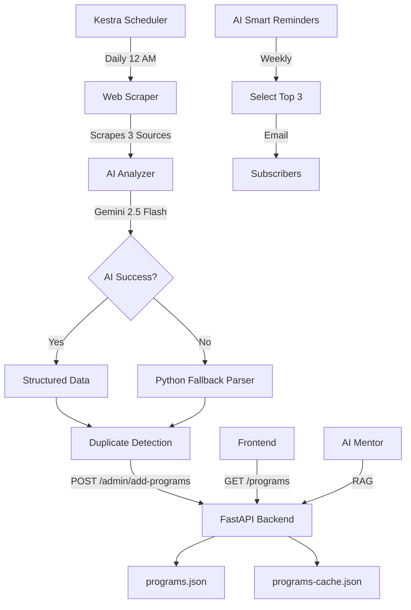

# 🚀 OpenSourceHub

<div align="center">


[](https://fastapi.tiangolo.com/)
[](https://python.org)
[](https://ai.google.dev/)
[](https://docker.com)

**Discover, Track, and Never Miss Open-Source Opportunities**

[✨ Features](#-features) • [🎯 Architecture](#-architecture) • [🚀 Quick Start](#-quick-start) • [📖 Documentation](#-documentation)

</div>

---

## 📋 Table of Contents

- [Overview](#-overview)
- [Features](#-features)
- [Architecture](#-architecture)
- [Tech Stack](#-tech-stack)
- [Quick Start](#-quick-start)
- [API Endpoints](#-api-endpoints)
- [Kestra Workflows](#-kestra-workflows)
- [Project Structure](#-project-structure)
- [Contributing](#-contributing)
- [License](#-license)

---

## 🌟 Overview

**OpenSourceHub** is an intelligent platform that automatically discovers, curates, and notifies you about open-source programs, internships, and opportunities from across the web. Powered by **Kestra's AI workflows** and **Google Gemini**, it eliminates manual searching and ensures you never miss application deadlines.

### 🎯 Problem We Solve

- ❌ Missing deadlines for GSoC, Outreachy, MLH Fellowship, etc.
- ❌ Spending hours searching across multiple websites
- ❌ Outdated or duplicate program information
- ❌ No personalized recommendations based on your interests

### ✅ Our Solution

- ✅ **AI-Powered Web Scraping**: Automatically discovers new programs daily
- ✅ **Smart Duplicate Detection**: Prevents database pollution
- ✅ **Intelligent Reminders**: AI selects high-impact programs for you
- ✅ **Real-Time Updates**: Database syncs automatically via Kestra workflows
- ✅ **AI Mentor Chat**: Get personalized recommendations 24/7

---

## ✨ Features

### 🤖 AI Automation (Powered by Kestra)

| Feature | Description | Workflow |
|---------|-------------|----------|
| 🔍 **Web Scraping** | DuckDuckGo search + BeautifulSoup extracts program details | `ai-daily-scraper.yaml` |
| 🧠 **Smart Analysis** | Gemini AI formats unstructured data into structured cards | `ai-daily-scraper.yaml` |
| 🎯 **Duplicate Detection** | Backend filters duplicates by name, slug, and URL | Backend API |
| 📧 **Smart Reminders** | AI picks top 3 high-impact programs and emails subscribers | `ai-smart-reminders.yaml` |
| 🔄 **Fallback Parser** | Python-based detection when AI quota is exceeded | `ai-daily-scraper.yaml` |

### 🌐 Web Platform Features

- **Dynamic Filtering**: Filter by category, difficulty, tags, deadlines
- **AI Mentor Chat**: Agentic RAG system for personalized guidance
- **Email Subscriptions**: Stay updated with weekly digests
- **Responsive Design**: Works seamlessly on mobile, tablet, and desktop
- **Animated UI**: Beautiful gradient backgrounds and smooth transitions

---

## 🎯 Architecture



### 🔄 Workflow Pipeline

1. **Discovery Phase** (`ai-daily-scraper`)
   - Searches DuckDuckGo for open-source programs
   - Extracts URLs and scrapes content (3000 chars/source)
   - Handles redirect URLs and cleans HTML

2. **Analysis Phase** (AI/Fallback)
   - **AI Path**: Gemini analyzes content and formats JSON
   - **Fallback Path**: URL matching + keyword scanning
   - Detects: Outreachy, MLH, LFX, GSoC, Hacktoberfest, Season of Docs

3. **Storage Phase** (Backend)
   - Compares with existing programs (case-insensitive)
   - Filters duplicates by name/slug/URL
   - Updates both `programs.json` and `programs-cache.json`

4. **Notification Phase** (`ai-smart-reminders`)
   - AI selects top 3 high-impact programs
   - Generates HTML emails with program cards
   - Sends to all subscribers via SMTP

---

## 🛠 Tech Stack

### Backend
- **FastAPI** - High-performance REST API
- **Pydantic** - Data validation and serialization
- **Python 3.11** - Core programming language

### AI & Automation
- **Kestra 1.1.8** - Workflow orchestration platform
- **Google Gemini 2.5 Flash** - AI text analysis
- **BeautifulSoup4** - HTML parsing and scraping
- **DuckDuckGo Search** - Web discovery (no API key needed)

### Frontend
- **Vanilla JavaScript** - No framework overhead
- **CSS3 Animations** - Smooth gradient transitions
- **Anime.js** - Advanced animations
- **Responsive Design** - Mobile-first approach

### DevOps
- **Docker & Docker Compose** - Containerization
- **Kestra Docker Image** - Workflow engine
- **Python HTTP Server** - Static file serving

---

## 🚀 Quick Start

### Prerequisites

- Docker & Docker Compose
- Python 3.11+
- Git

### 1️⃣ Clone Repository

```bash
git clone https://github.com/yourusername/OpenSourceHub.git
cd OpenSourceHub
```

### 2️⃣ Start Kestra

```bash
docker-compose up -d
```

Access Kestra UI: **http://localhost:8080**
- Username: `id`
- Password: `pass`

### 3️⃣ Upload Workflows

```bash
# Upload AI Daily Scraper
curl -X POST http://localhost:8080/api/v1/flows/import \
  -u 'id:pass' \
  -F fileUpload=@kestra/ai-daily-scraper.yaml

# Upload AI Smart Reminders
curl -X POST http://localhost:8080/api/v1/flows/import \
  -u 'id:pass' \
  -F fileUpload=@kestra/ai-smart-reminders.yaml
```

### 4️⃣ Start Backend

```bash
# Create virtual environment
python -m venv .venv
source .venv/bin/activate  # Windows: .venv\Scripts\activate

# Install dependencies
pip install -r requirements.txt

# Run FastAPI server
uvicorn backend.main:app --reload --host 0.0.0.0 --port 8000
```

Access API: **http://localhost:8000**

### 5️⃣ Start Frontend

```bash
# Serve static files
python -m http.server 8000 --directory frontend
```

Access UI: **http://localhost:8000**

---

## 📡 API Endpoints

### Programs

| Method | Endpoint | Description |
|--------|----------|-------------|
| `GET` | `/programs` | Get all programs |
| `GET` | `/programs/{id}` | Get program by ID |
| `POST` | `/admin/add-programs` | Add new programs (with duplicate detection) |
| `GET` | `/admin/latest-additions` | Get recently added programs |

### Subscribers

| Method | Endpoint | Description |
|--------|----------|-------------|
| `GET` | `/subscribers` | Get all subscribers |
| `POST` | `/subscribe` | Add new subscriber |

### AI Mentor

| Method | Endpoint | Description |
|--------|----------|-------------|
| `POST` | `/agent/chat` | Chat with AI mentor (RAG) |

---

## 🔄 Kestra Workflows

### 1. `ai-daily-scraper.yaml`

**Purpose**: Automated program discovery and ingestion

**Schedule**: Daily at 12:00 AM (commented out by default)

**Steps**:
1. **fetch-existing-programs** - GET `/programs`
2. **search-programs** - DuckDuckGo HTML search (3 queries)
3. **scrape-web-sources** - Extract content (3000 chars each)
4. **ai-analyze-programs** - Gemini analyzes and formats JSON
5. **add-to-scraper-file** - POST to `/admin/add-programs`
6. **execution-summary** - Display results

**Features**:
- ✅ URL extraction from DuckDuckGo redirects
- ✅ Content cleaning (removes scripts, nav, footer)
- ✅ Two-pass fallback detection (URL → Content)
- ✅ `allowFailure: true` on AI task (handles quota limits)

### 2. `ai-smart-reminders.yaml`

**Purpose**: Weekly high-impact program notifications

**Schedule**: Weekly (commented out by default)

**Steps**:
1. **fetch-all-programs** - GET `/programs`
2. **fetch-subscribers** - GET `/subscribers`
3. **ai-smart-analysis** - Gemini selects top 3 programs
4. **generate-email-html** - Creates responsive HTML
5. **send-to-subscribers** - SMTP email delivery
6. **execution-summary** - Display results

**AI Decision Criteria**:
- Paid/stipend programs (GSoC, Outreachy, LFX)
- Well-known prestigious programs
- Career-boosting opportunities

---

## 📁 Project Structure

```
OpenSourceHub/
├── backend/
│   ├── agents/
│   │   ├── __init__.py
│   │   └── open_source_mentor.py    # AI Mentor RAG agent
│   ├── main.py                       # FastAPI application
│   ├── models.py                     # Pydantic models
│   ├── subscriptions.json            # Subscriber emails
│   └── sent_notifications.json       # Notification history
├── frontend/
│   ├── index.html                    # Main UI
│   ├── styles.css                    # Responsive styling
│   ├── app.js                        # JavaScript logic
│   └── programs-cache.json           # Frontend cache
├── kestra/
│   ├── ai-daily-scraper.yaml         # Web scraper workflow
│   └── ai-smart-reminders.yaml       # Email notification workflow
├── scraper/
│   └── scrape_programs.py            # Legacy scraper (unused)
├── docker-compose.yml                # Kestra orchestration
├── requirements.txt                  # Python dependencies
├── programs.json                     # Programs database
└── README.md                         # This file
```

---

## 🧪 Testing

### Manual Workflow Execution

```bash
# Trigger AI Daily Scraper
curl -X POST http://localhost:8080/api/v1/executions/opensource/ai-daily-scraper \
  -u 'id:pass'

# Trigger AI Smart Reminders
curl -X POST http://localhost:8080/api/v1/executions/opensource/ai-smart-reminders \
  -u 'id:pass'
```

### View Execution Logs

Navigate to: **http://localhost:8080/ui/executions**

---

## 🔧 Configuration

### Environment Variables

Create `.env` file (optional):

```env
# Gemini AI (already embedded in workflows)
GEMINI_API_KEY=API_Key

# SMTP (for reminders)
SMTP_USERNAME=user mail
SMTP_PASSWORD=app password
```

### Enable Scheduled Workflows

Uncomment the `triggers:` section in workflow files:

```yaml
triggers:
  - id: daily-schedule
    type: io.kestra.plugin.core.trigger.Schedule
    cron: "0 0 * * *"  # Daily at 12 AM (midnight)
```

---

## 🎨 Screenshots

### Homepage


### AI Mentor Chat


### Program Filters


## 📄 License

This project is licensed under the MIT License - see the [LICENSE](LICENSE) file for details.

---

## 🙏 Acknowledgments

- **Kestra** - For the amazing workflow orchestration platform
- **Google Gemini** - For powerful AI capabilities
- **FastAPI** - For the high-performance web framework
- **DuckDuckGo** - For privacy-focused search

---

<div align="center">

**⭐ Star this repo if you find it useful!**

Made with ❤️ using Kestra AI Workflows

</div>
